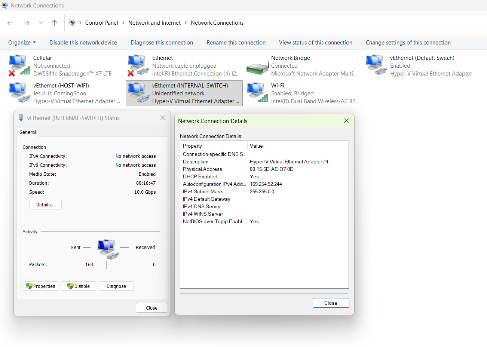
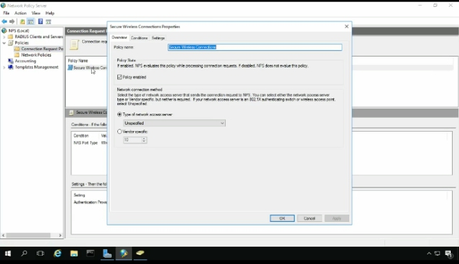

## Cengage Network+ 10th Edition 

Author: Jill West

Date: Sep 7, 2026

* * *

<br>

## Chapter one: Introduction to Networking

Networking is everywhere

**Configured as such because I have another laptop network cable connected directly without a switch and don’t want windows 11 to manage internal network settings - only SOPHOS FIREWALL.**

<br>



<br>


* * *

<br>
<br>

Synology DSM’s Active Backup for Business (ABB) suite is a great backup solution, but after the initial installation or reinstallation, it requires activation with a Synology account to use.

Active Backup for Business is great, but it requires logging into an account and online activation for first-time use

However, I don’t like offline software that requires online activation to function — if the server fails or goes offline one day, or if there’s a local network issue, and I happen to have reinstalled the software, it becomes unusable.

There are several methods circulating online for local activation of such suites, but they are quite complex. So, I spent some time write a simple and universal activation method for future use.

> Please note that using this method for local activation may affect your product support and services. Especially in enterprise, it is recommended to use the standard online activation method to ensure full support and services.

## Tutorial

This method supports local activation for Synology Active Backup for Business, Synology AI Console, and other suites.

1. Open the suite and go to the activation page/popup
2. Open the browser’s developer tools (F12) -> Console, paste the following code, and press Enter to apply

- Please perform the operation on the Synology DSM (e.g. address bar displays 192.168.X.X). Do not go to the official website (e.g. address bar displays activation.synology.com).

<br>


<br>

```
const oldWindowOpen = window.open
window.open = (...args) => {
    const [url] = args
    if (url?.startsWith('https://activation.synology.com/package')) {
        const u = new URL(url)
        setTimeout(() => {
            window.dispatchEvent(new MessageEvent('message', {
                data: {
                    source: u.searchParams.get('package_name'),
                    package_name: u.searchParams.get('package_name'),
                    request_id: u.searchParams.get('request_id')
                },
                origin: "https://activation.synology.com"
            }))
        }, 100)
        setTimeout(() => {
            alert('Activation finished, please refresh the page.')
            window.open = oldWindowOpen
        }, 1000)
    } else {
        alert('Activation failed.')
    }
}
```

```
const oldWindowOpen = window.open
window.open = (...args) => {
    const [url] = args
    if (url?.startsWith('https://activation.synology.com/package')) {
        const u = new URL(url)
        setTimeout(() => {
            window.dispatchEvent(new MessageEvent('message', {
                data: {
                    source: u.searchParams.get('package_name'),
                    package_name: u.searchParams.get('package_name'),
                    request_id: u.searchParams.get('request_id')
                },
                origin: "https://activation.synology.com"
            }))
        }, 100)
        setTimeout(() => {
            alert('Activation finished, please refresh the page.')
            window.open = oldWindowOpen
        }, 1000)
    } else {
        alert('Activation failed.')
    }
}
```

3. lick the activation button to complete the activation.

**Coxxs**

> This article ([https://dev.moe/3126](https://dev.moe/3126)) is an original work by Coxxs. Please credit the original link when reposting.

Posted by [Coxxs](https://dev.moe/en/author/coxxs)[2025-05-01](https://dev.moe/en/3126)

<br>

* * *

<br>

### Add a quote

> Knowing yourself is the beginning of all wisdom.  
> **― Aristotle**

<br>

### Add a code block (Premium ⭐)

```
const message = 'Hello World'
console.log(message)
```

<br>

### Organize note content into a table (Premium ⭐)

|     |     |     |
| --- | --- | --- |
| ## **Subject** |     | **Grade** |
| Physics | Practical | A   |
| Theory | B+  |

<br>

### Write an equation

$$x=\\frac{-b\\pm \\sqrt{b^2-4ac}}{2a}$$

<br>

### Link notes 🔗

- You can link to other notes. For example, see [[Explore UpNote features]].
- To link to another note, simply type `[[` and choose the note you want to refer to. You can learn more about note linking [here](https://medium.com/upnote/bi-directional-links-in-upnote-63631bd36b2a).

<br>

### Unlock the full power of UpNote with Premium

- Upgrade once and use UpNote on all your devices.
- See **Settings > Premium** for more details ⭐.

<br>

### Thank you for trying UpNote!

If you enjoy UpNote, please consider leaving a rating in the store where you installed the app. Your support helps us improve UpNote for everyone.

<br>

**Ordered list** 

1. **==list 1==**
2. **==list 2==**
3. **==list 3==**

**<br>
**

Sep 5, 2026, 8:18 PM

# heading 1

- [ ] checklist 1
- [ ] checklist 2
- [ ] checklist 3

### collapse 1

**content for collapse 1**

<br>

## Chapter two:

<br>
<br>

### Add a quote

> Knowing yourself is the beginning of all wisdom.  
> **―Aristotle**

<br>

### Add a code block (Premium⭐)

```
const message = 'Hello World'
console.log(message)
```

<br>

### Organize note content into table (Premium ⭐)

|     |     |     |
| --- | --- | --- |
| **Subject** |     | **Grade** |
| Physics | Practical | A   |
| Theory | B+  |

<br>

## Chapter three: Collapsible content

<br>

Before modifying the GPO, restrict who can use or manage the printer directly at the server level.

<br>

1. Open **Active Directory Users and Computers (`dsa.msc`)**.
2. Create two global security groups:

<br>
    - `PRN-Photosmart-Users` (For standard users who only need to print)
    - `PRN-Photosmart-Managers` (For users who need to pause or clear print queues) \[5\]
3. Open the **Print Management Console (`printmanagement.msc`)** on the print server. \[1\]
4. Right-click your shared **HP Photosmart 5510** -> **Properties** -> **Security** tab.
5. Remove **Everyone** from the list to secure the printer.
6. Add your groups and assign permissions exactly as shown below:

| Security Group | Print Permission | Manage this Printer | Manage Documents |
| --- | --- | --- | --- |
| **`PRN-Photosmart-Users`** | ✅ Allow | ❌ Deny | ❌ Deny |
| **`PRN-Photosmart-Managers`** | ✅ Allow | ❌ Deny | ✅ Allow |
| **`Domain Admins`** | ✅ Allow | ✅ Allow | ✅ Allow |

* * *

<br>

`code here`  

<br>

## Chapter Four: Another Collapsible


<br>